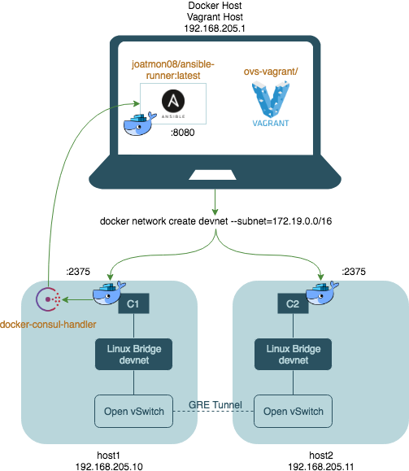

# 2018 Cisco DevNet Create

This project automates the [Kubernetes lab on Multi-Host Networking](http://docker-k8s-lab.readthedocs.io/en/latest/docker/docker-ovs.html),
where two Docker hosts have containers that need to route to each other. This is
not a recommended set up, but it is an interesting exercise in automation and
testing. The focus is on unit, contract, and integration tests to
build confidence in automation before applying it end-to-end.

**The code serves as an example. It omits important features that enable it
to run in production.**

## Dependencies
1. [docker-consul-handler](https://github.com/joatmon08/docker-consul-handler).
   Image located at [Docker Hub](https://hub.docker.com/r/joatmon08/docker-consul-handler/).
1. [ansible-runner](https://github.com/joatmon08/ansible-runner). This needs
   to be running on your Ansible control host to execute the OVS playbook.
   Image located at [Docker Hub](https://hub.docker.com/r/joatmon08/ansible-runner/).
1. [Vagrant](https://www.vagrantup.com/downloads.html). You will need the
   [openvswitch-docker Vagrant box](https://app.vagrantup.com/joatmon08/boxes/openvswitch-docker).
1. Python virtualenv

## Design Principles
* The Docker network and its bridge name must be the same.
* There is a Consul backend for Docker on one host. The second host
  does not have it.
* There is an external container that runs the Ansible playbook against
  the specific hosts.

## Automation Workflow
1. When creating a Docker network on Host 1, the Docker network is updated
in the Consul KV store. There is no Consul KV store on Host 2.
1. The Consul KV store on Host 1 has a watcher in its configuration, which
fires a handler that calls a container called "ansible-runner" (see Dependencies).
The ansible-runner is hosted on a Docker host, exposed on port 8080 and its
sole responsibility is to run a playbook.
1. The ansible-runner runs the "playbook" to configure openvswitch on each
host. For reference, the veth interfaces are based on the minute and second
of creation.



## Tests
To more easily run the tests, a Python makefile has the set of tasks
and dependencies to facilitate tests.

### Linting
Linting checks for:
* YAML indentation & syntax
* Python PEP8 compliance using flake8

#### Pre-Requisites
* Python3
* yamllint
* flake8

#### Run
```
make lint_yaml
make lint_python
```

### Unit Tests
Unit tests include:
* tests to check the commands in the Ansible playbook (such as bridge)

When it checks the Ansible playbook, it creates an openvswitch Vagrant box
and quickly runs the playbook against it. It uses pytest to assert if the
playbook ran to completion.

#### Pre-Requisites
* Python3
* pytest
* Vagrant

#### Run
```
make unit
```

### Contract Tests
Contract/service tests checks the call of the docker-consul-handler
against the playbook's expected input.
It creates a Vagrant box with the base minimum dependencies
required for the handler.

#### Pre-Requisites
* Python3
* pytest
* Vagrant

#### Run
```
make contract
```

### Integration Tests
The integration tests include a simple smoke test that creates two containers
on the Docker network and issues a ping call between them to determine if
there is connectivity. See the `tests/smoke/features` directory for more
information.

**This test takes about 10-15 minutes to run, since it has to create two
hosts, install Docker, pull images, etc. Optimizations are not
implemented in this code base.**

The BDD feature:
1. Creates two hosts using Vagrant, host1 on 192.168.205.10 and host2
on 192.168.205.11.
1. Creates the ansible-runner container on the Vagrant host, with playbook
and SSH configuration mounted.
1. Creates the container network with name and CIDR block listed in
`features/connectivity.feature`.
1. Runs a smoke test under smoke.py. This creates a container on host1
and a container on host2, then issues a ping command between the containers.

#### Pre-Requisites
* Python3
* You must run `pip install -r requirements.txt`.
* Vagrant
* [joatmon08/ansible-runner:latest](https://hub.docker.com/r/joatmon08/ansible-runner/)

#### Run
```
make integration
```

## Pipeline
If you're interested in running the pipeline job, located in `pipeline.gocd.yaml`,
you can create a [GoCD](https://docs.gocd.org/current/installation/installing_go_agent.html) master
using the `docker-compose.yaml` in this repository. It will create a master in a Docker container.

You'll still need to install the agent separately for your operating system, see the link above
for installation steps. After you install the agent:

* Be sure to "enable" it under the "Agents" tab on the master.
* Go to `Admin > Config XML` and add the following under the `<server>`
  declaration in the XML.
  ```
  <config-repos>
    <config-repo pluginId="yaml.config.plugin" id="devnet">
      <git url="https://github.com/joatmon08/2018-cisco-devnet-create.git" />
    </config-repo>
  </config-repos>
  ```
* You may need to set up some environment variables,
  depending on how your system is configured. See GoCD
  help documentation for your operation system.

The repository will be automatically added to GoCD and should begin to run.

## References
* [Multi-Host Networking](http://docker-k8s-lab.readthedocs.io/en/latest/docker/docker-ovs.html)

## Manual Commands
## Vagrant SSH
Use `vagrant ssh-config` to retrieve the SSH configuration for the hosts.
You can pipe this to ssh-config and edit the configuration for the correct
identity file.

## Docker Network Creation
Create Docker network with custom bridge name:
```
docker network create -o "com.docker.network.bridge.name"="rlw" hi
```

## Open vSwitch Ansible Playbook
To run the Ansible playbook for Open vSwitch on its own, run:
```
ansible-playbook site.yml -b -i hosts --extra-vars "container_network=test"
```
